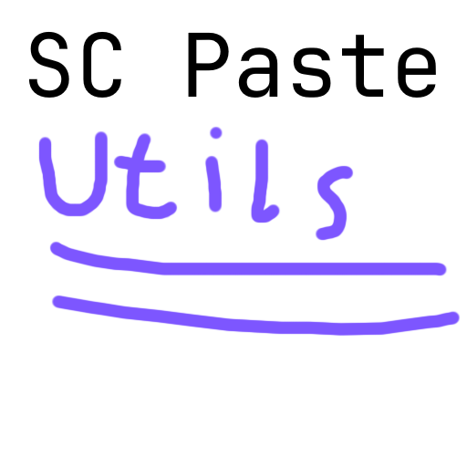

# SCPasteUtils

SCPasteUtils is a userscript made for the paste server (and website) called [SCPaste](https://p.sc3.io).


This is a userscript initiated from [@violentmonkey/generator-userscript](https://github.com/violentmonkey/generator-userscript).

## Installing

### Requirements

- [Violentmonkey userscript loader](https://violentmonkey.github.io/)

### Installation process

1. Click the violentmonkey icon in your browser extensions
2. Press the settings wheel
3. Press the "+" button in the top left corner
4. Select "Install from URL"
5. Paste in `https://p.sc3.io/api/v1/pastes/TUWRCk8J6t/raw`
6. Press "OK"
7. A new tab should open, click "Confirm installation"
8. SCPasteUtils is now "installed"

## Configuring

1. Go to [SCPaste](https://p.sc3.io)
2. Press the text saying "Utils"
3. A dialog box should come up, with settings
4. Press "Save & close" to exit. The page should refresh

## Development

### To auto-compile

```sh
npm run dev
```

### To serve the files

```sh
cd dist
npx http-server -c5
```

### To auto-reload in Violentmonkey

1. Open `localhost:8080/index.user.js` in your browser
2. Enable `Track local file before this window is closed`
3. Press `Confirm installation`
4. Open SCPaste in a new tab, and reload SCPAste once you have changed things
